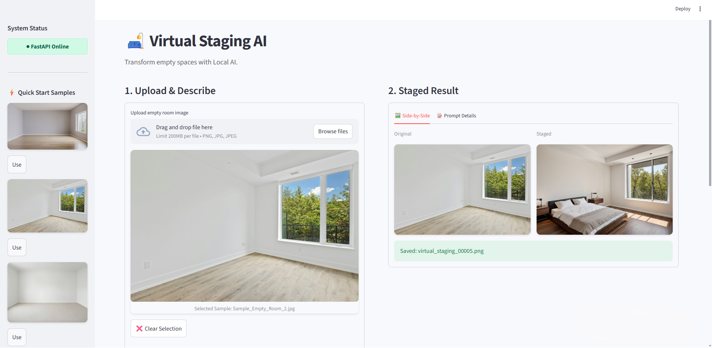
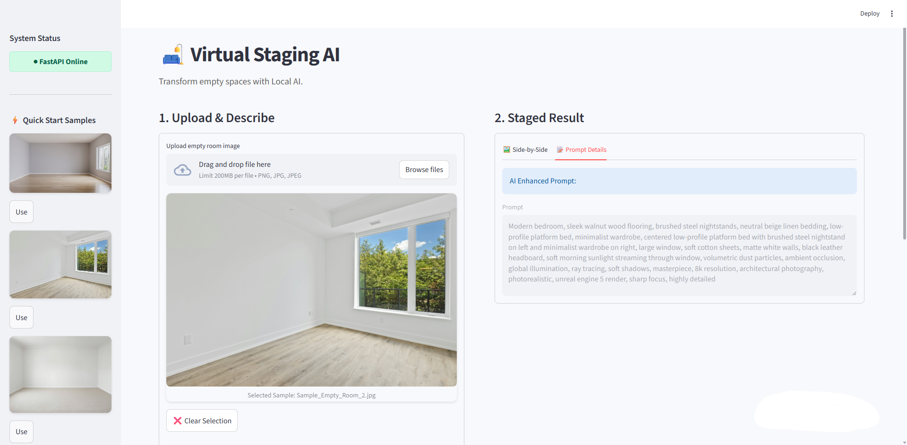
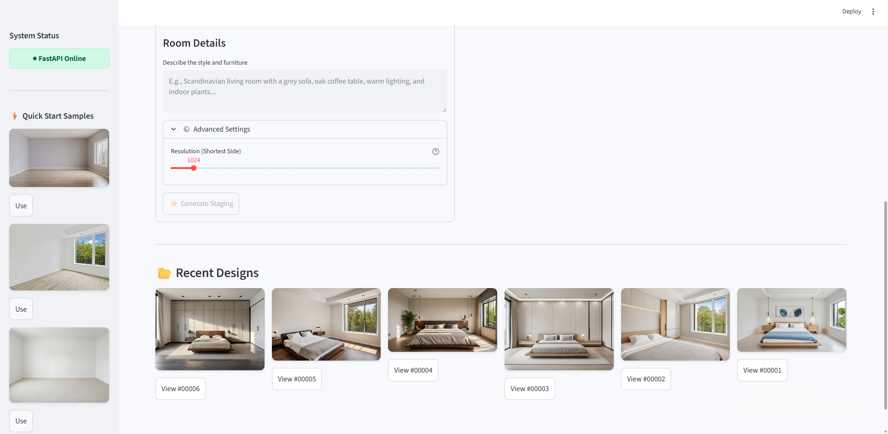

# Virtual Staging AI

A locally hosted application that transforms photos of empty rooms into fully furnished interiors using Generative AI.

This project orchestrates **Stable Diffusion XL (via ComfyUI)** for photorealistic image generation and **Ollama (Local LLM)** for intelligent prompt enhancement, wrapped in a user-friendly **Streamlit** interface.


<!-- MAIN HERO IMAGE -->

*Side-by-side comparison: Original empty room vs. AI Staged Interior.*

## Features

- **Natural Language Staging:** Simply describe the style (e.g., *"Modern Scandinavian living room"*), and the local LLM refines it into a professional architectural prompt.
- **Structural Integrity:** Uses advanced **ControlNet Union** pipelines (Lineart, Segment, and Depth) to strictly preserve walls, windows, and floors while adding furniture.
- **Local & Private:** Runs entirely offline (after model download). No data leaves your machine.
- **Comparison Gallery:** Side-by-side comparison of original vs. staged images with metadata history.
- **Dynamic Quality:** Adjustable resolution slider (768px to 4096px) to balance generation speed vs. high-fidelity detail.
- **Instant Preview:** Comes with pre-staged examples in the gallery so you can verify the UI immediately upon launch.

## Interface Overview

### Intelligent Prompt Enhancement
Switch to the **"Prompt Details"** tab to see how the local LLM (Ollama) takes your simple description and expands it into a highly detailed architectural prompt for Stable Diffusion.



### History & Advanced Controls
Scroll down to access the **Resolution (Shortest Side)** slider under **Advanced Settings** for 4K upscaling, as well as the **Recent Designs** gallery. Click any previous generation to instantly restore it to the main view for comparison.



## Project Structure

```text
virtual-staging-ai/
├── .venv/                 # Python Virtual Environment (Local only)
├── assets/                # Documentation Images & Screenshots
├── app/                   # Application Source Code
│   ├── main.py            # FastAPI Backend
│   ├── app.py             # Streamlit Frontend
│   ├── img2img.py         # ComfyUI Interface
│   ├── config.py          # Model & Path Configuration
│   └── ...
├── ComfyUI/               # ComfyUI Instance (Cloned by user)
├── data/                  # Data Directory
│   ├── inputs/            # User uploads (Gitignored)
│   ├── outputs/           # Generated images (Gitignored)
│   └── samples/           # Included example images
├── workflows/             # ComfyUI JSON Workflows
├── log/                   # Application Logs
├── run.py                 # Master Startup Script (Cross-platform)
├── stop.py                # Cleanup Script (Cross-platform)
└── requirements.txt       # Python Dependencies
```

## Prerequisites

1.  **OS:** Windows 10/11 (Recommended), Linux, or macOS (Apple Silicon).
2.  **GPU:** NVIDIA GPU with at least 8GB VRAM recommended for SDXL operations.
3.  **Python:** Version 3.10 or higher.
4.  **Git:** Installed and available in your terminal.
5.  **Ollama:** Installed and running. [Download Ollama](https://ollama.com/download).

## Installation

Follow these steps **in order** to ensure dependencies do not conflict.

### 1. Clone the Project
```bash
git clone https://github.com/Xd06eR/virtual-staging-ai.git
cd virtual-staging-ai
```

### 2. Set up Python Environment
Create and activate the virtual environment, then upgrade pip.

**Windows:**
```bash
py -m venv .venv
.venv\Scripts\activate
py -m pip install --upgrade pip
```

**Linux / macOS:**
```bash
python3 -m venv .venv
source .venv/bin/activate
pip install --upgrade pip
```

### 3. Install ComfyUI & Manager
We must install ComfyUI's dependencies **before** the project requirements.
```bash
# 1. Clone ComfyUI
git clone https://github.com/comfyanonymous/ComfyUI.git

# 2. Install ComfyUI Dependencies
cd ComfyUI
pip install -r requirements.txt

# 3. Install ComfyUI-Manager
cd custom_nodes
git clone https://github.com/ltdrdata/ComfyUI-Manager.git
cd ../..
```

### 4. Install Project Dependencies
Now install the requirements for the Virtual Staging App.
```bash
pip install -r requirements.txt
```

### 5. Install Custom Nodes via Manager
The workflow relies on specific custom nodes. 
1.  Run ComfyUI manually once: `python ComfyUI/main.py`
2.  Open your browser to `http://127.0.0.1:8188`.
3.  Click **Manager** (top right menu) -> **Custom Nodes Manager**.
4.  Search for and install these two nodes:
    *   `comfyui_controlnet_aux` (by Fannovel16)
    *   `wlsh_nodes` (by wallish77)
5.  **Close ComfyUI** (Ctrl+C in terminal) once installed.

### 6. Download AI Models
Download the following models and place them in the specific folders inside `ComfyUI/models/`.

| Model Type | Recommended File | Target Folder | Download Link |
| :--- | :--- | :--- | :--- |
| **Checkpoint** | `juggernautXL_ragnarokBy.safetensors` | `ComfyUI/models/checkpoints/` | [Civitai Link](https://civitai.com/models/133005/juggernaut-xl) |
| **ControlNet** | `controlnet++_union_sdxl_promax.safetensors` | `ComfyUI/models/controlnet/` | [HuggingFace Link](https://huggingface.co/xinsir/controlnet-union-sdxl-1.0) |
| **Upscaler** | `4x-UltraSharpV2.pth` | `ComfyUI/models/upscale_models/` | [HuggingFace Link](https://huggingface.co/Kim2091/UltraSharpV2) |

> **Note on Preprocessors:** The `depth_anything_v2_vitl.pth` model will usually **download automatically** the first time you generate an image. If it fails, check the ComfyUI console logs for the manual download link.

### 7. Setup Ollama
Pull the Qwen model used for prompt enhancement (or any other model defined in `config.py`):
```bash
ollama pull qwen3:4b
```

## Usage

### 1. Start the System
Run the cross-platform launcher script. This handles the orchestration of FastAPI, Streamlit, and ComfyUI.
```bash
python run.py
```
*Linux/Mac users: You may need to run `chmod +x run.py` first.*

### 2. Access the UI
The browser should open automatically. If not, visit:
`http://localhost:8501`

### 3. Stop the System
To shut down all services cleanly:
```bash
python stop.py
```

## Contributing

Contributions are welcome! Please open an issue or submit a pull request for improvements.

## License

This project is licensed under the [MIT License](LICENSE).

---
*Inspired by my internship at Latote Technology Limited.*
